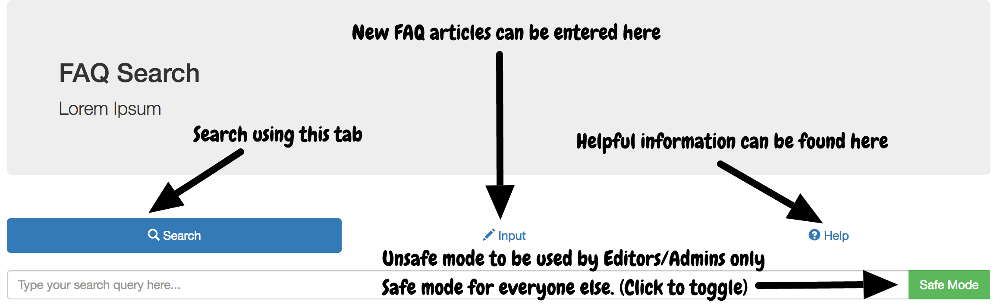
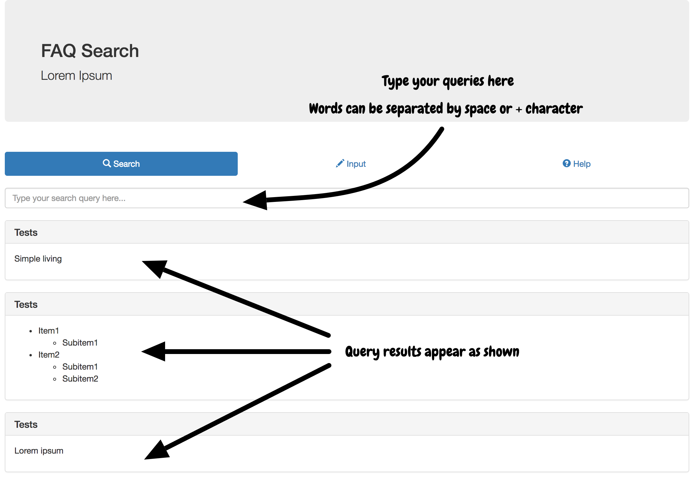
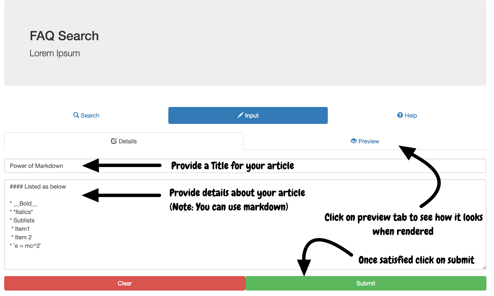
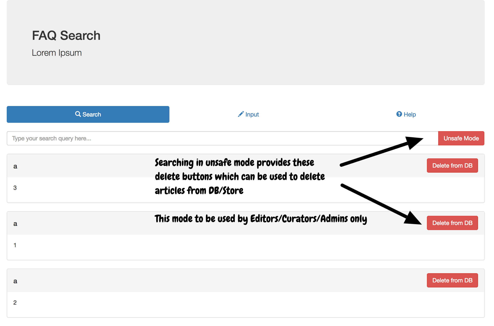

# faq

[](https://raw.githubusercontent.com/csurfer/faq/master/LICENSE)

Minimalistic search app for Frequently Asked Questions with Markdown support built on [Elasticsearch](https://www.elastic.co/) using [Nodejs](https://nodejs.org/en/), [Angularjs](https://angularjs.org/) and [Bootstrap](http://getbootstrap.com/).

# Features
:star: Out of the box working.

:star: Markdown fully supported.

:star: Highly responsive.

:star: Mobile friendly.

# Installation pre-requisites

* Ensure you have `npm` installed.
* Download `zip` of elasticsearch binary [here](https://www.elastic.co/downloads/elasticsearch) and unzip it. Tested on (5.0.2, 5.1.1).
```bash
# You can use this command to fetch the zip.
wget https://artifacts.elastic.co/downloads/elasticsearch/elasticsearch-5.1.1.zip
```
* Enable CORS calls by adding __[Note: Be careful with the network configuration!]__
```bash
# IP of the host where Elasticsearch is running.
network.host: 1.2.3.4

# Following allows calls from localhost.
# Change the regex to suit your needs.
http.cors:
    enabled: true
    allow-origin: /https?:\/\/localhost(:[0-9]+)?/
```
to `elasticsearch/config/elasticsearch.yml`.

# Installation

```bash
# Clone the repository.
git clone https://github.com/csurfer/faq.git

# cd into it.
cd faq

# Install npm dependencies.
npm install

# To check its working.
npm start
```

# Using the app

## App Navigation


## Search


## Creating new article


## Editing or Curation using admin mode

